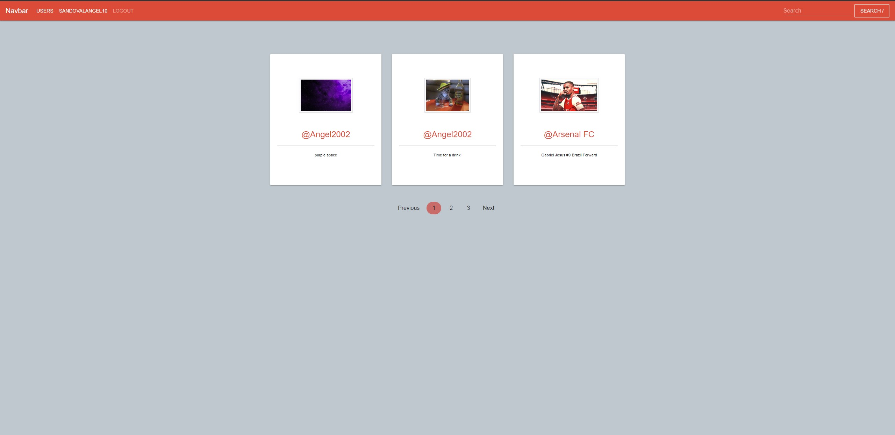

# THETA

This project is a social media app where users can share their thoughts as well as images with other users. Users are able to create, update, and delete posts. This application uses Graphql, Mongo, Express, React, and Node for a true realtime web application. Frontend uses latest Hooks from React, React Router and Apollo Client for performing Queries, Mutations and Subscriptions. This Project also utilizes React Hooks including Context API to achieve Redux like architecture.

- #### Heroku Deployment from EPW80 [here](https://gql-client-epw.herokuapp.com/profile)
- #### Heroku Deployment from angel3510 [here](https://gql-client-angel.herokuapp.com/)
- #### Heroku Deployment from Anchoviess [here](https://gql-client-kalo.herokuapp.com/)

- Test User Credentials
    - Click on **`Login`** for Testing

- #### Github Repository [link](https://github.com/EPW80/THETA)

### Technology and Modules used for this Project

1. `Node JS Express Framework` is used as a building Backend part of this Website.
2. `MySQL` is used to Store User Details, passwords and URL of Photos.
3. `JWT` is used for for Authenticate a User. User can only authenticate using **Custom Email Password** Method.
4. `React JS` is used as frontend Framework for building SPA.
5. `Redux` for State Management on React Application
6. `Bootstrap` is used for building UI and this website is Responsive for Desktop Devices and Tabs only (I am working on for responsiveness on small Devices)
7. `Heroku` is used for hosting the backend code and frontend as well.

 - Run this command

     ```
     $ npm run server // to start only Backend server

     $ npm run Client // to start React Development server only

     
### Website Preview





### COMPLETE:

- Email Verification by Google API
- User Profile Image upload feature (Cloudinary API)
- Forgot Password Feature
- Pagination feature on Posts and Developers page

---

## Team

Erik Williams
<br>
Anthony Ledesma
<br>
Angel Sandoval

Please feel free to contact me if you need any further information:

- [Erik Williams](https://github.com/EPW80)
    <br>
- [Anthony Ledesma](https://github.com/Anchoviess)
    <br>
- [Angel Sandoval](https://github.com/angel3510)
